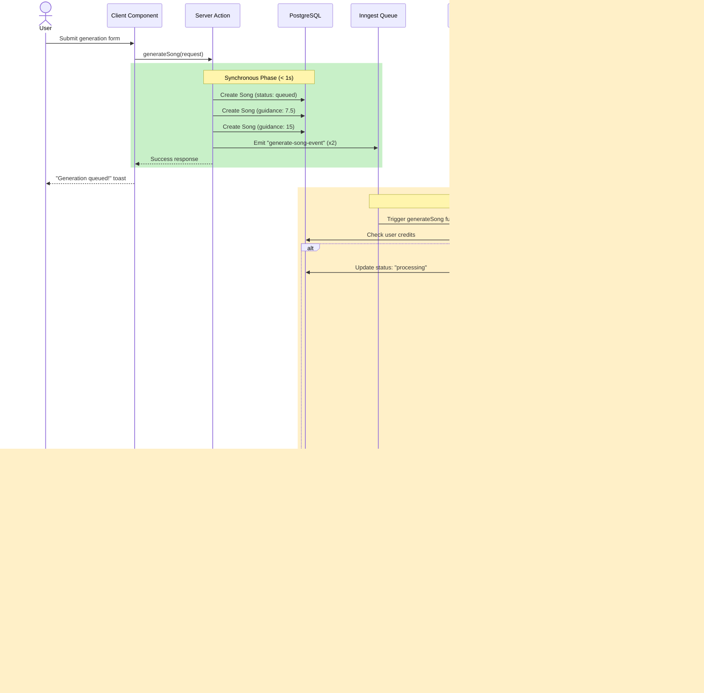

# MelodyMakerAI - Architecture Documentation

## 📐 System Architecture

This document provides an in-depth technical overview of MelodyMakerAI's architecture, design decisions, and implementation patterns.

## Table of Contents

- [High-Level Architecture](#high-level-architecture)
- [Frontend Architecture](#frontend-architecture)
- [Backend Architecture](#backend-architecture)
- [Data Flow](#data-flow)
- [Database Design](#database-design)
- [Authentication & Authorization](#authentication--authorization)
- [Background Job Processing](#background-job-processing)
- [AI Model Pipeline](#ai-model-pipeline)
- [Storage Strategy](#storage-strategy)
- [Performance Optimizations](#performance-optimizations)
- [Security](#security)
- [Scalability](#scalability)
- [Design Patterns](#design-patterns)
- [Trade-offs & Decisions](#trade-offs--decisions)

---

## High-Level Architecture

MelodyMakerAI follows a **serverless-first, event-driven architecture** with clear separation of concerns:


### Key Design Principles

1. **Serverless-First**: Minimize infrastructure management
2. **Event-Driven**: Async processing for long-running tasks
3. **Type-Safe**: End-to-end TypeScript with strict mode
4. **Modular**: Clear separation of concerns
5. **Scalable**: Auto-scaling infrastructure components

---

## Frontend Architecture

### Next.js 15 App Router

```
frontend/
├── app/
│   ├── (auth)/          # Route group for authentication
│   ├── (main)/          # Route group for main app
│   └── api/             # API routes (webhooks only)
├── actions/             # Server Actions (main backend logic)
├── components/          # React components
│   ├── ui/             # Reusable UI primitives
│   └── [feature]/      # Feature-specific components
├── lib/                # Utilities & configurations
├── stores/             # Client state (Zustand)
└── hooks/              # Custom React hooks
```

### Component Architecture


### State Management Strategy

| State Type | Solution | Reason |
|------------|----------|--------|
| **Server State** | React Server Components | Automatic data fetching, no client bundle |
| **Global Client State** | Zustand | Audio player state (lightweight) |
| **Form State** | React useState | Simple, no library needed |
| **Theme State** | next-themes | Built-in dark mode support |
| **URL State** | Next.js router | Navigation & search params |

### Why Server Actions Over API Routes?

**Server Actions provide:**
- ✅ Type-safe end-to-end (shared types)
- ✅ No need to define routes
- ✅ Automatic request/response serialization
- ✅ Better integration with RSC
- ✅ Progressive enhancement support

**Trade-off:**
- ❌ Not RESTful (but we don't need external API consumers)
- ❌ Harder to test in isolation (but simpler overall)

---

## Backend Architecture

### Server Actions Pattern

All backend logic lives in `/src/actions/` as Server Actions:

```typescript
// actions/generation.ts
"use server"

import { auth } from "~/lib/auth"
import { db } from "~/server/db"
import { inngest } from "~/inngest/client"

export async function generateSong(request: GenerateRequest) {
  // 1. Authentication
  const session = await auth.api.getSession({ headers: await headers() })
  if (!session) redirect("/auth/sign-in")
  
  // 2. Database mutation
  const song = await db.song.create({ data: {...} })
  
  // 3. Event emission (async processing)
  await inngest.send({ name: "generate-song-event", data: {...} })
  
  // 4. Cache revalidation
  revalidatePath("/create")
}
```

### Why This Pattern?

1. **Co-location**: Logic near components that use it
2. **Type Safety**: Shared types between client and server
3. **Simplicity**: No API layer needed
4. **Performance**: Server Components fetch directly

---

## Data Flow

### Music Generation Flow (Detailed)



### Read Flow (Song Playback)


---

## Database Design

### Schema Design Principles

1. **Normalized**: Reduce redundancy, ensure consistency
2. **Indexed**: Strategic indexes on frequently queried fields
3. **Cascading Deletes**: Automatic cleanup of related records
4. **Composite Keys**: Efficient junction tables

### Key Relationships


### Index Strategy

| Table | Index | Reason |
|-------|-------|--------|
| `Song` | `userId` | Filter by user's songs |
| `Song` | `published` | Find public songs |
| `Song` | `createdAt` | Sort by date |
| `Song` | `s3Key` | Lookup by file |
| `Like` | `songId` | Count likes per song |
| `Follow` | `followerId, followingId` | Social graph queries |
| `PlaylistSong` | `playlistId` | Fetch playlist items |

### Why SQLite for Development?

- ✅ Zero configuration
- ✅ Fast local development
- ✅ Easy to reset/seed
- ⚠️ **Must use PostgreSQL in production** (for Inngest, Better Auth, etc.)

---

## Authentication & Authorization

### Better Auth Architecture


### Session Management

- **Storage**: Database (Prisma)
- **Cookie**: HTTP-only, Secure, SameSite
- **Expiry**: 30 days (configurable)
- **Refresh**: Automatic on valid cookie

### Authorization Patterns

```typescript
// Pattern 1: Ownership check
export async function renameSong(songId: string, newTitle: string) {
  const session = await auth.api.getSession({ headers: await headers() })
  if (!session) redirect("/auth/sign-in")
  
  await db.song.update({
    where: {
      id: songId,
      userId: session.user.id  // ✅ Ownership check in WHERE clause
    },
    data: { title: newTitle }
  })
}

// Pattern 2: Explicit check
export async function getUserProfile(userId: string) {
  const session = await auth.api.getSession({ headers: await headers() })
  if (!session) redirect("/auth/sign-in")
  
  const isOwnProfile = session.user.id === userId
  
  // ✅ Different logic based on authorization
  const songs = await db.song.findMany({
    where: {
      userId,
      ...(isOwnProfile ? {} : { published: true })
    }
  })
}
```

---

## Background Job Processing

### Inngest Architecture


### Function Configuration

```typescript
export const generateSong = inngest.createFunction(
  {
    id: "generate-song-event",
    
    // Concurrency control: max 1 generation per user
    concurrency: {
      limit: 1,
      key: "event.data.userId"
    },
    
    // Auto-retry configuration
    retries: 3,
    
    // Failure handler
    onFailure: async ({ event }) => {
      await db.song.update({
        where: { id: event.data.songId },
        data: { status: "failed" }
      })
    }
  },
  { event: "generate-song-event" },
  async ({ event, step }) => {
    // Step-based execution with automatic retries
  }
)
```

### Why Inngest Over Alternatives?

| Feature | Inngest | BullMQ | AWS SQS |
|---------|---------|--------|---------|
| **Serverless** | ✅ | ❌ | ✅ |
| **Zero Config** | ✅ | ❌ | ❌ |
| **Dashboard** | ✅ | 🟡 | 🟡 |
| **Step Functions** | ✅ | ❌ | ❌ |
| **Auto Retry** | ✅ | ✅ | ✅ |
| **Concurrency Control** | ✅ | ✅ | ❌ |
| **Cost** | Free tier | Self-hosted | Pay-per-request |

**Decision**: Inngest provides the best developer experience for our use case.

---

## AI Model Pipeline

### Modal Deployment Strategy

```python
@app.cls(
    image=image,
    secrets=[melodymaker_secrets],
    gpu="L40S",                    # NVIDIA L40S GPU
    volumes={
        "/models": modal_volume,    # Persistent model storage
        "/.cache/huggingface": hf_volume
    },
    scaledown_window=15             # Keep warm for 15 seconds
)
class MusicGenServer:
    @modal.enter()
    def load_modal(self):
        # Load models once on container start
        self.music_model = ACEStepPipeline(...)
        self.llm_model = AutoModelForCausalLM.from_pretrained(...)
        self.image_pipe = AutoPipelineForText2Image.from_pretrained(...)
```

### Model Caching Strategy


**Cold Start**: ~30-45 seconds  
**Warm Start**: ~500ms  
**Strategy**: Keep warm for 15s to handle bursts

### AI Pipeline Flow

```mermaid
graph LR
    A[User Input] --> B{Mode?}
    
    B -->|Simple| C[Generate Prompt<br/>Qwen]
    B -->|Custom| E[Use Custom Prompt]
    
    C --> D{Instrumental?}
    E --> D
    
    D -->|No| F[Generate Lyrics<br/>Qwen]
    D -->|Yes| G[Use [instrumental]]
    
    F --> H[Generate Music<br/>ACE-Step]
    G --> H
    
    H --> I[Generate Cover<br/>SDXL Turbo]
    
    I --> J[Auto-Categorize<br/>Qwen]
    
    J --> K[Upload to B2]
    
    style C fill:#a78bfa
    style F fill:#a78bfa
    style H fill:#f472b6
    style I fill:#60a5fa
    style J fill:#a78bfa
```

---

## Storage Strategy

### Backblaze B2 Architecture


### File Naming Strategy

- **Audio Files**: `{uuid}.wav` (e.g., `a3f7e9d2-4b1c-4e8f-9a3e-7c2d8f1b4e9a.wav`)
- **Cover Images**: `{uuid}.png` (e.g., `b4e8f1d3-5c2d-4f9e-0b4f-8d3e9g2c5f0b.png`)

**Why UUIDs?**
- ✅ Guaranteed uniqueness
- ✅ Prevents path traversal attacks
- ✅ No filename conflicts
- ✅ Scalable

### Pre-signed URL Strategy

```typescript
export async function getPresignedUrl(key: string) {
  const s3Client = new S3Client({
    region: "region",
    endpoint: env.B2_ENDPOINT,
    credentials: {
      accessKeyId: env.B2_KEY_ID,
      secretAccessKey: env.B2_APP_KEY,
    },
  })
  
  const command = new GetObjectCommand({
    Bucket: env.B2_BUCKET_NAME,
    Key: key,
  })
  
  // ⏱️ 1-hour expiry
  return await getSignedUrl(s3Client, command, { expiresIn: 3600 })
}
```

**Benefits:**
- ✅ Secure: No public file access
- ✅ Time-limited: URLs expire after 1 hour
- ✅ Direct download: Client fetches directly from B2
- ✅ Reduces server load: No proxying

---

## Performance Optimizations

### 1. Server Components by Default

```typescript
// ✅ Server Component (default)
export default async function Page() {
  const songs = await db.song.findMany()  // Server-side query
  return <SongList songs={songs} />
}

// ⚠️ Only use "use client" when needed
"use client"
export function SongCard({ song }) {
  const [isPlaying, setIsPlaying] = useState(false)  // Client state
  return <div onClick={() => setIsPlaying(true)}>...</div>
}
```

### 2. Image Optimization

```typescript
<Image
  src={song.thumbnailUrl}
  alt={song.title}
  width={200}
  height={200}
  // ✅ Automatic optimization, WebP conversion, lazy loading
/>
```

### 3. Database Query Optimization

```typescript
// ✅ Select only needed fields
const songs = await db.song.findMany({
  select: {
    id: true,
    title: true,
    thumbnailS3Key: true,
    user: {
      select: { name: true }  // Only user name, not all fields
    },
    _count: {
      select: { likes: true }  // Aggregate query
    }
  }
})

// ❌ Don't fetch everything
const songs = await db.song.findMany()  // Fetches all fields
```

### 4. Caching Strategy

| Layer | Strategy | TTL |
|-------|----------|-----|
| **Pre-signed URLs** | Generated on-demand | 1 hour |
| **Server Components** | ISR (incremental static regeneration) | On-demand |
| **Inngest Results** | Database record | Permanent |
| **Modal Models** | Volume caching | Persistent |

---

## Security

### 1. Environment Variable Validation

```typescript
// env.js - Type-safe runtime validation
export const env = createEnv({
  server: {
    DATABASE_URL: z.string().url(),
    BETTER_AUTH_SECRET: z.string().min(32),
    MODAL_KEY: z.string(),
    // ... all required vars
  },
  client: {
    // Public vars only
  },
  runtimeEnv: process.env,
  skipValidation: !!process.env.SKIP_ENV_VALIDATION,
  emptyStringAsUndefined: true,
})
```

### 2. SQL Injection Prevention

✅ **Prisma ORM**: Parameterized queries by default
```typescript
// ✅ Safe
await db.song.findMany({
  where: { userId: session.user.id }
})

// ❌ Never do this
await db.$executeRaw`SELECT * FROM Song WHERE userId = ${userId}`
```

### 3. Authorization Checks

```typescript
// ✅ Always check ownership
export async function deleteSong(songId: string) {
  const session = await auth.api.getSession({ headers: await headers() })
  if (!session) redirect("/auth/sign-in")
  
  // Ownership check in WHERE clause
  await db.song.delete({
    where: {
      id: songId,
      userId: session.user.id  // ✅ Ensures user owns the song
    }
  })
}
```

### 4. Rate Limiting

**Modal Endpoints**: Built-in rate limiting via proxy authentication
```python
@modal.fastapi_endpoint(method="POST", requires_proxy_auth=True)
def generate_with_description(self, request):
    # Modal handles rate limiting automatically
```

**Inngest**: Concurrency control prevents abuse
```typescript
concurrency: {
  limit: 1,              // Max 1 generation
  key: "event.data.userId"  // Per user
}
```

---

## Scalability

### Horizontal Scalability


### Database Scaling

**Neon PostgreSQL**:
- ✅ Auto-scaling compute
- ✅ Connection pooling
- ✅ Read replicas (paid tier)
- ✅ Automatic backups

**Prisma Connection Pooling**:
```typescript
// ✅ Single instance pattern
export const db = new PrismaClient({
  log: process.env.NODE_ENV === "development" ? ["query", "error", "warn"] : ["error"],
})
```

### Modal Scaling

- **Cold starts**: 30-45s (first request)
- **Warm instances**: 500ms (subsequent requests)
- **Auto-scaling**: Based on queue depth
- **Cost**: Pay only for GPU time used

---

## Design Patterns

### 1. Repository Pattern (Implicit)

Server Actions act as repositories:
```typescript
// actions/song.ts = Song repository
export async function getSong(id: string) { ... }
export async function createSong(data: SongData) { ... }
export async function updateSong(id: string, data: Partial<SongData>) { ... }
```

### 2. Event-Driven Pattern

```typescript
// Emit event (fire and forget)
await inngest.send({
  name: "generate-song-event",
  data: { songId, userId }
})

// Handler runs asynchronously
export const generateSong = inngest.createFunction(
  { event: "generate-song-event" },
  async ({ event }) => { ... }
)
```

### 3. Factory Pattern

```typescript
// AI pipeline factory
class MusicGenServer:
    def generate_and_upload_to_s3(self, prompt, lyrics, ...):
        # Factory method for generation
```

### 4. Strategy Pattern

```typescript
// Different generation strategies based on mode
if (song.fullDescribedSong) {
  endpoint = env.GENERATE_FROM_DESCRIPTION
} else if (song.lyrics && song.prompt) {
  endpoint = env.GENERATE_WITH_LYRICS
} else if (song.describedLyrics && song.prompt) {
  endpoint = env.GENERATE_FROM_DESCRIBED_LYRICS
}
```

---

## Trade-offs & Decisions

### 1. Server Actions vs REST API

**Decision**: Server Actions  
**Trade-off**:
- ✅ Simpler, type-safe, faster development
- ❌ Not suitable for external API consumers (but we don't need that)

### 2. Inngest vs Self-Hosted Queue

**Decision**: Inngest (managed service)  
**Trade-off**:
- ✅ Zero infrastructure, great DX, automatic retries
- ❌ Vendor lock-in, cost at scale

### 3. SQLite (dev) vs PostgreSQL (prod)

**Decision**: Use both  
**Trade-off**:
- ✅ Fast local development, easy reset
- ⚠️ Potential compatibility issues (mitigated by Prisma)

### 4. Modal vs AWS Lambda

**Decision**: Modal  
**Trade-off**:
- ✅ Better GPU support, simpler deployment, model caching
- ❌ Newer platform, smaller community

### 5. Pre-signed URLs vs Proxying

**Decision**: Pre-signed URLs  
**Trade-off**:
- ✅ Reduces server load, better performance
- ⚠️ URLs expire after 1 hour (acceptable for our use case)

### 6. Dual Generation (guidance 7.5 & 15)

**Decision**: Always generate 2 versions  
**Trade-off**:
- ✅ Better user choice, higher quality
- ❌ 2x cost per generation (acceptable given credits system)

---

## Contributing to Architecture

When making architectural changes:

1. **Document the decision**: Update this file
2. **Consider trade-offs**: Document pros/cons
3. **Performance**: Profile before/after
4. **Security**: Conduct threat modeling
5. **Scalability**: Test under load
6. **Maintainability**: Keep it simple

---

## References

- [Next.js Documentation](https://nextjs.org/docs)
- [Prisma Best Practices](https://www.prisma.io/docs/guides/performance-and-optimization)
- [Modal Documentation](https://modal.com/docs)
- [Inngest Documentation](https://www.inngest.com/docs)
- [Better Auth Documentation](https://better-auth.dev)

---

**Last Updated**: October 2025  
**Version**: 1.0.0
